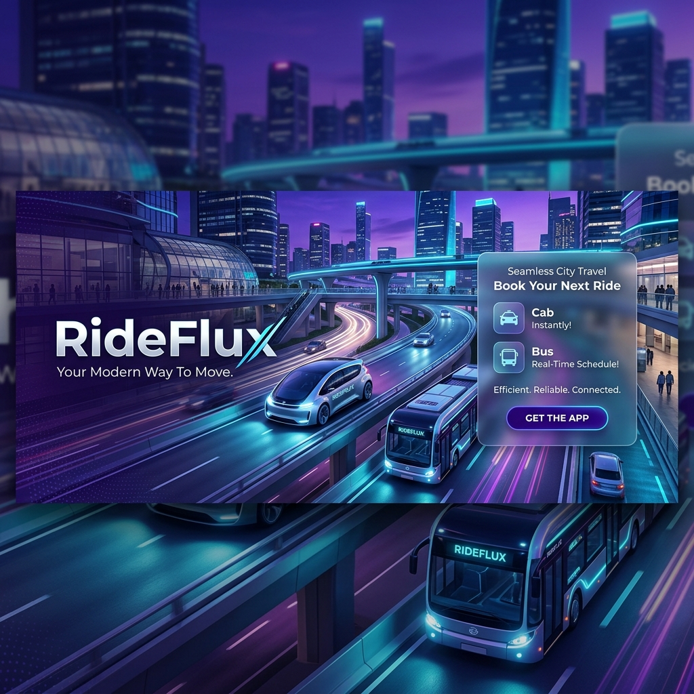
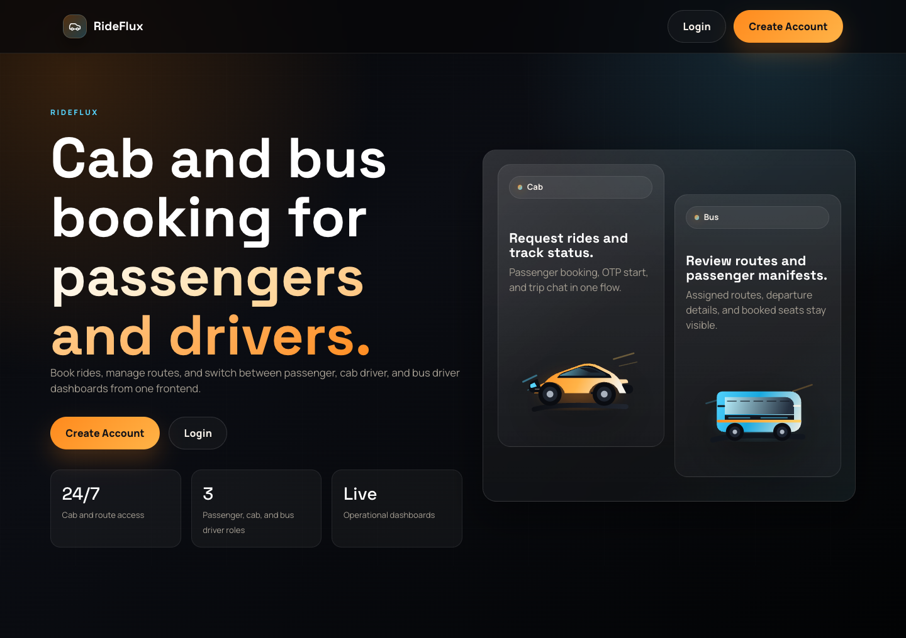
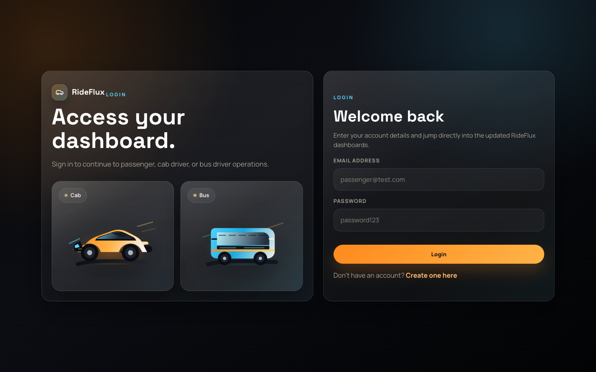
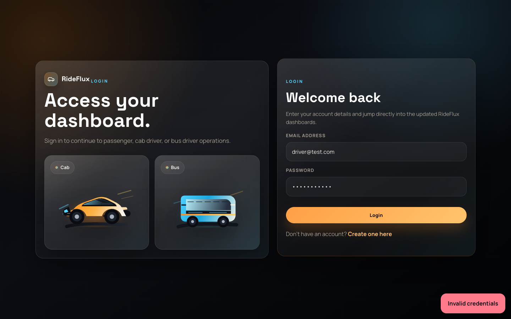

<div align="center">
  

  # 🚖 RideFlux 🚌

  **A High-Performance Cab & Bus Booking Ecosystem**
  *Engineered with the Anti-Gravity Architecture — Minimal Dependencies, Maximum Velocity.*

  [](https://opensource.org/licenses/MIT)
  [](https://nodejs.org/)
  [](http://makeapullrequest.com)
  [](https://en.wikipedia.org/wiki/Glassmorphism)

  [Overview](#-overview) • [Visual Tour](#-visual-tour) • [Key Features](#-key-features) • [Tech Stack](#-tech-stack) • [Getting Started](#-getting-started) • [API Documentation](#-api-documentation)
</div>

---

## 🌟 Overview

**RideFlux** is a state-of-the-art transportation platform designed to bridge the gap between passengers and drivers (Cabs & Buses). By leveraging real-time socket communication and a lightweight backend, RideFlux provides a seamless booking experience without the overhead of heavy frameworks.

### 🚀 Why RideFlux?
- **Anti-Gravity Architecture**: Built to be dependency-light, ensuring rapid deployment and extreme performance.
- **Privacy-First Chat**: Ephemeral, room-based communication that never touches the database.
- **Unified Ecosystem**: Manage Cabs and Buses in a single, intuitive interface.
- **Glassmorphism UI**: A modern, premium design system that feels alive and responsive.

---

## 📸 Visual Tour

<div align="center">
  <table>
    <tr>
      <td width="50%"><br><sub><b>Landing Page</b></sub></td>
      <td width="50%"><br><sub><b>Secure Auth</b></sub></td>
    </tr>
    <tr>
      <td width="50%"><br><sub><b>Passenger Hub</b></sub></td>
      <td width="50%"><br><sub><b>Cab Driver Interface</b></sub></td>
    </tr>
  </table>
</div>

---

## ✨ Key Features

### 🔐 Advanced Authentication
- **Secure Sessions**: JWT-based authentication with automatic expiration handling.
- **Role-Based Access**: Specialized dashboards for **Passengers**, **Cab Drivers**, and **Bus Drivers**.
- **Smart Onboarding**: Dynamic registration forms tailored to user roles.

### 🚖 Cab Booking Engine
- **Real-Time Dispatch**: Ride requests are broadcasted instantly to all available drivers.
- **Lifecycle Management**: Full tracking from `Searching` → `Accepted` → `Started` → `Completed`.
- **OTP Verification**: Secure 4-digit verification to ensure passenger safety.
- **Live Status Updates**: Powered by Socket.io for zero-latency feedback.

### 💬 Ride-Time Ephemeral Chat
- **Instant Messaging**: Real-time communication during active rides.
- **Zero Footprint**: Messages exist only in memory and disappear the moment the ride ends.
- **Room-Based**: Private, ride-specific chat rooms.

### 🚌 Bus Booking System
- **Comprehensive Search**: View routes, departure times, fares, and seat availability at a glance.
- **Seat Selection**: Interactive booking for specific seat numbers.
- **Manifest Management**: Dedicated interface for bus drivers to manage passenger lists.

---

## 🛠 Tech Stack

| Layer | Technology | Description |
| :--- | :--- | :--- |
| **Frontend** | Vanilla HTML5, CSS3, JS (ES6+) | Blazing fast, zero-build frontend. |
| **Backend** | Node.js + Express | Robust and scalable API layer. |
| **Database** | MongoDB + Mongoose | Flexible NoSQL schema for rapid iteration. |
| **Real-time** | Socket.io | Bi-directional communication for live updates. |
| **Security** | JWT + Bcrypt | Industry-standard encryption and auth. |

---

## 📂 Project Structure

<details>
<summary><b>Click to expand directory tree</b></summary>

```text
RideFlux/
├── assets/                     # Repository assets (Banner, Screenshots)
├── frontend/                   # Zero-build static frontend
│   ├── index.html              # Modern Landing Page
│   ├── login.html              # Authentication
│   ├── register.html           # Role-based Registration
│   ├── dashboard-passenger.html # Passenger Hub
│   ├── css/style.css           # Premium Glassmorphism Design System
│   └── js/                     # Modular Logic
│
└── backend/                    # Node.js API
    ├── server.js               # Entry Point
    ├── seed.js                 # Database Seeder
    ├── models/                 # Mongoose Schemas
    ├── routes/                 # Express Controllers
    └── sockets/                # Real-time Handlers
```
</details>

---

## 🚀 Getting Started

### 1. Prerequisites
- **Node.js** (v18+)
- **MongoDB** (Local or Atlas)

### 2. Installation & Setup

```bash
# Clone the repository
git clone https://github.com/yourusername/RideFlux.git
cd RideFlux

# Install Dependencies (Root & Backend)
npm install
npm run backend-install
```

### 3. Run the Application

```bash
# Seed initial data (Admin/Test accounts)
npm run seed

# Start the server
npm run dev
```

### 4. Launch Frontend
Simply open `frontend/index.html` in your browser or use a live server extension.

---

## 🧪 Test Accounts

| Role | Email | Password |
| :--- | :--- | :--- |
| **Passenger** | `passenger@test.com` | `password123` |
| **Cab Driver** | `driver@test.com` | `password123` |
| **Bus Driver** | `bus@test.com` | `password123` |

---

## 📖 API Documentation

<details>
<summary><b>View Authentication Endpoints</b></summary>

| Method | Endpoint | Access |
| :--- | :--- | :--- |
| POST | `/api/auth/register` | Public |
| POST | `/api/auth/login` | Public |
</details>

<details>
<summary><b>View Cab Service Endpoints</b></summary>

| Method | Endpoint | Access |
| :--- | :--- | :--- |
| GET | `/api/cab/drivers` | Passenger |
| POST | `/api/cab/request` | Passenger |
| POST | `/api/cab/accept/:rideId` | Cab Driver |
| POST | `/api/cab/start/:rideId` | Cab Driver |
| POST | `/api/cab/complete/:rideId` | Cab Driver |
</details>

---

<div align="center">
  <p>Built with ❤️ by the RideFlux Team</p>
  <p><i>Pushing the boundaries of minimal, high-performance web architecture.</i></p>
</div>
